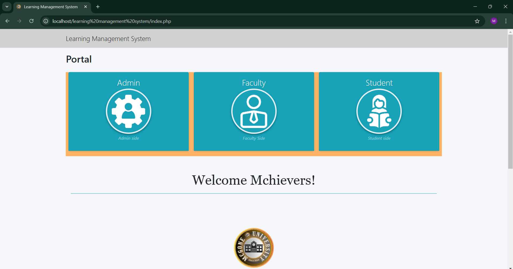

# my-projects
Learning Management System (LMS) is a web-based platform for students, teachers, and administrators. Students can access lessons, take quizzes, and submit answers. Teachers manage learning materials and quizzes, while administrators handle user accounts and system management. Screenshots are provided for portfolio presentation.
Screenshot 2024-12-23 124224.png
## Screenshots

